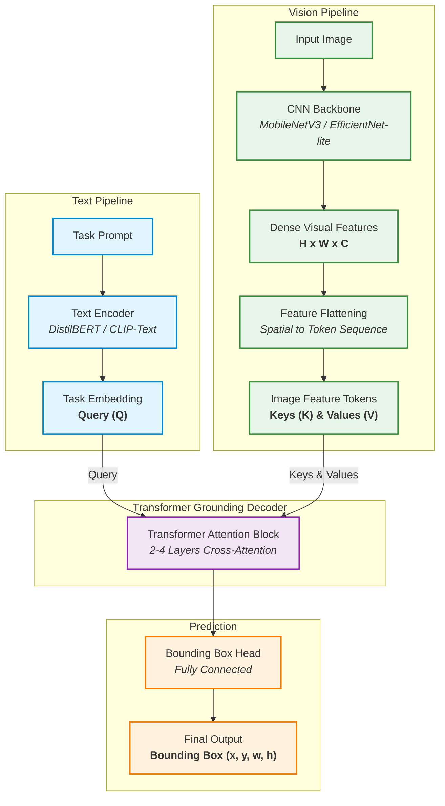
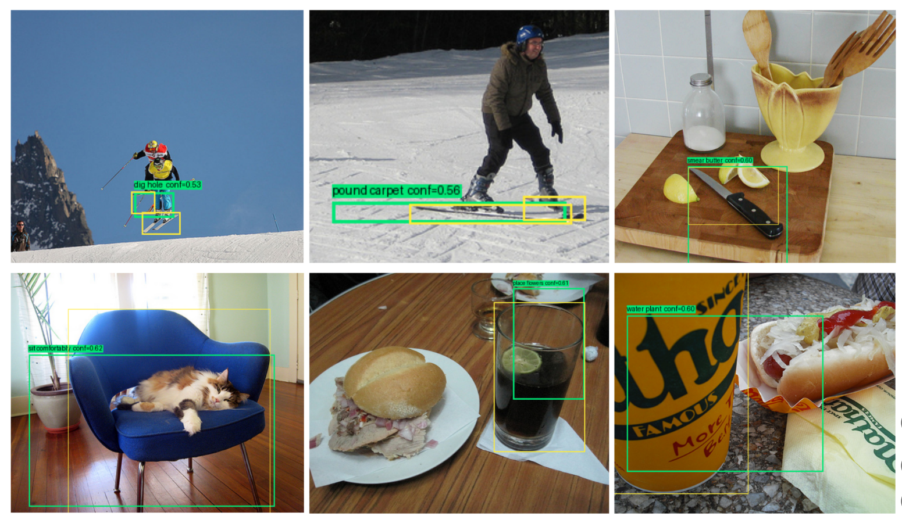

# DualEncoderSingleDecoder
## <ins> Context Aware / task specific object detection framework, based on Dual Encoder Single Decoder architecture. </ins>

This repository contains the training code for the task specific object detection framework whose Dual Encoder Single Decoder architecture is heavily inspired by CLIP and DETR papers.

# Architecture

The architecture is a lightweight dual-encoder system designed to preserve semantic grounding capabilities while maintaining a low parameter count. It consists of three main pathways:

1. **Text Pathway (Task Encoding):** Converts natural language prompts into semantic token embeddings using a frozen text encoder (e.g., DistilBERT).
2. **Vision Pathway (Visual Feature Extraction):** Extracts spatial feature maps from input images using a lightweight CNN backbone.
3. **Transformer Grounding Head:** A cross-attention module that fuses the text queries with visual keys/values to predict the region of interest.

### Architecture Diagram

# Some Results:

_ToDo: Add more description about the project, training methods, evalution, curves etc_
