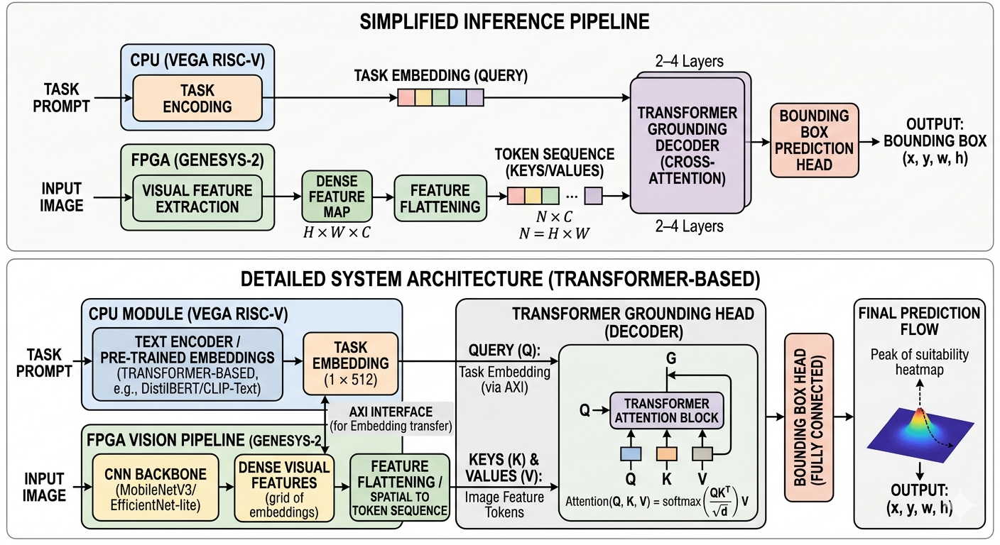

# DualEncoderSingleDecoder
## <ins> Context Aware / task specific object detection framework, based on Dual Encoder Single Decoder architecture. </ins>

This repository contains the training code for the task specific object detection framework whose Dual Encoder Single Decoder architecture is heavily inspired by CLIP and DETR papers.

## The Architecture:

_ToDo: Add more description about the project, training methods, evalution, curves etc_
